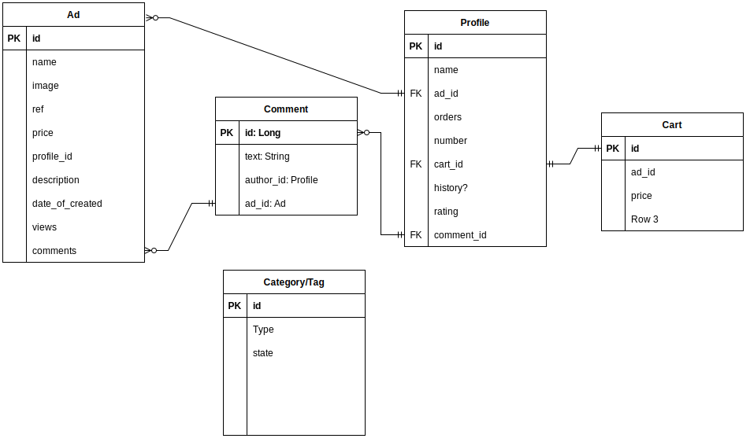

# Waceplare. Система размещения частных объявлений

## Описание:
Система состоит из серверной части и [мобильного клиента](https://github.com/E6L1PS/waceplare_app_mobile).

Стек технологий серверной части:
+ Spring Boot
+ Spring Web
+ Spring Data JPA
+ PostgreSQL
+ Spring Security
+ JUnit + Mockito

ERD:

Данный проект был сделан в рамках программы профессиональной переподготовки "Разработка мобильных приложений для Андроид на языке Котлин".

## Функционал веб-приложения:
1. Регистрация пользователя в системе.
2. Просмотр списка объявлений. Поиск и фильтрация.
3. Возможность добавления / редактирования / удаления объявлений.
4. Возможность добавить / удалить избранное объявление.
5. Возможность оставлять комментарии под объявлениями.
6. Возможность проплатить отображение в топе выдачи.
7. Система рейтингов продавцов, влияющая на положение объявлений продавца в поисковой выдаче. Чем ниже рейтинг, тем ниже объявления в выдаче.
8. Истории продаж пользователя.
9. Редактирование профиля.
10. Организация личной переписки покупателя и продавца.

### В планах:
1. Покрыть полностью тестами.
2. Добавить пагинацию.
3. Docker + CI/CD
4. OAth2